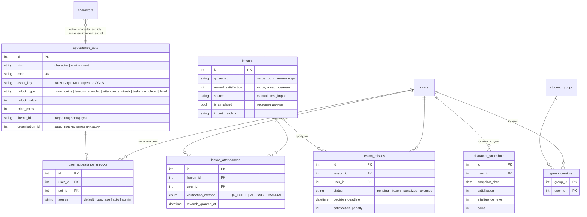

# Диаграмма базы данных - Тамагочи-Метавселенная

## ERD диаграмма (Entity-Relationship Diagram)

```mermaid
erDiagram
    %% Основные сущности
    User ||--o| Character : "has"
    User ||--o{ Task : "creates"
    User ||--o{ Habit : "creates"
    User ||--o{ UserItem : "owns"
    User ||--o{ UserAchievement : "earns"
    User ||--o{ Clan : "owns"
    User ||--o{ ClanMember : "member_of"
    User ||--o{ Friendship : "has"
    User ||--o{ GroupMember : "member_of"
    User ||--o{ Event : "creates"
    User ||--o{ EventAttendance : "attends"
    User ||--o{ ShopListing : "sells"
    User ||--o{ Transaction : "buys"
    User ||--o{ Transaction : "sells_items"
    User ||--o{ Competition : "organizes"

    %% Связи с предметами
    Item ||--o{ UserItem : "owned_by"
    Item ||--o{ Achievement : "reward"
    Item ||--o{ ShopListing : "listed"
    Item ||--o{ Transaction : "traded"

    %% Связи с достижениями
    Achievement ||--o{ UserAchievement : "earned_by"

    %% Привычки и логи
    Habit ||--o{ HabitLog : "has_logs"

    %% Кланы
    Clan ||--o{ ClanMember : "has_members"

    %% Группы студентов
    StudentGroup ||--o{ GroupMember : "has_members"

    %% События
    Event ||--o{ EventAttendance : "has_attendees"

    %% Соревнования
    Competition ||--o{ CompetitionParticipant : "has_participants"

    %% Таблица User
    User {
        int id PK
        string username UK
        string email UK
        datetime created_at
    }

    %% Таблица Character
    Character {
        int id PK
        int user_id FK "UNIQUE"
        string name
        int satisfaction "0-100"
        int intelligence_level
        int intelligence_points
        int bonus_points
        datetime created_at
        datetime updated_at
    }

    %% Таблица Task
    Task {
        int id PK
        int user_id FK
        string title
        text description
        enum status "todo|in_progress|completed|cancelled"
        enum priority "low|medium|high|urgent"
        datetime due_date
        datetime completed_at
        datetime created_at
        datetime updated_at
        int reward_coins
        int reward_intelligence_points
    }

    %% Таблица Habit
    Habit {
        int id PK
        int user_id FK
        string name
        text description
        enum frequency "daily|weekly|monthly"
        int target_count
        datetime created_at
        datetime updated_at
        int reward_coins
        int reward_intelligence_points
    }

    %% Таблица HabitLog
    HabitLog {
        int id PK
        int habit_id FK
        datetime completed_at
        text notes
    }

    %% Таблица Item
    Item {
        int id PK
        string name UK
        text description
        enum rarity "common|uncommon|rare|epic|legendary"
        enum type "consumable|equipment|decoration|special"
        int base_price
        datetime created_at
    }

    %% Таблица UserItem
    UserItem {
        int id PK
        int user_id FK
        int item_id FK
        int quantity
        datetime acquired_at
    }

    %% Таблица Achievement
    Achievement {
        int id PK
        string name UK
        text description
        string icon
        enum requirement_type
        int requirement_value
        int reward_coins
        int reward_item_id FK
        datetime created_at
    }

    %% Таблица UserAchievement
    UserAchievement {
        int id PK
        int user_id FK
        int achievement_id FK
        datetime earned_at
    }

    %% Таблица Clan
    Clan {
        int id PK
        string name UK
        text description
        int total_rating
        int owner_id FK
        datetime created_at
        datetime updated_at
    }

    %% Таблица ClanMember
    ClanMember {
        int id PK
        int clan_id FK
        int user_id FK
        enum role "member|moderator|admin"
        datetime joined_at
    }

    %% Таблица Friendship
    Friendship {
        int id PK
        int user_id FK
        int friend_id FK
        enum status "pending|accepted|rejected|blocked"
        datetime created_at
        datetime updated_at
    }

    %% Таблица StudentGroup
    StudentGroup {
        int id PK
        string name UK
        text description
        datetime created_at
        datetime updated_at
    }

    %% Таблица GroupMember
    GroupMember {
        int id PK
        int group_id FK
        int user_id FK
        datetime joined_at
    }

    %% Таблица Event
    Event {
        int id PK
        string name
        text description
        datetime start_time
        datetime end_time
        string location
        string qr_code
        int reward_coins
        int reward_intelligence_points
        int created_by FK
        datetime created_at
        datetime updated_at
    }

    %% Таблица EventAttendance
    EventAttendance {
        int id PK
        int event_id FK
        int user_id FK
        datetime attended_at
        enum verification_method "qr_code|message|manual"
    }

    %% Таблица ShopListing
    ShopListing {
        int id PK
        int seller_id FK
        int item_id FK
        int price
        int quantity
        enum status "active|sold|cancelled"
        datetime listed_at
        datetime updated_at
    }

    %% Таблица Transaction
    Transaction {
        int id PK
        int buyer_id FK
        int seller_id FK
        int item_id FK
        int price
        int quantity
        datetime transaction_date
    }

    %% Таблица Competition
    Competition {
        int id PK
        string name
        text description
        enum competition_type "rating|tasks|habits|intelligence"
        date start_date
        date end_date
        int created_by FK
        datetime created_at
        datetime updated_at
    }

    %% Таблица CompetitionParticipant
    CompetitionParticipant {
        int id PK
        int competition_id FK
        enum participant_type "user|clan|group"
        int participant_id
        int score
        datetime joined_at
        datetime updated_at
    }
```



## Описание связей

### Основные связи:

1. **User → Character**: Один к одному. У каждого пользователя один персонаж.

2. **User → Task/Habit**: Один ко многим. Пользователь создаёт множество задач и привычек.

3. **Habit → HabitLog**: Один ко многим. Привычка может иметь множество записей выполнения.

4. **User → UserItem**: Один ко многим. Пользователь владеет множеством предметов.

5. **Item → UserItem**: Один ко многим. Предмет может принадлежать многим пользователям.

6. **User → UserAchievement**: Один ко многим. Пользователь может получить много достижений.

7. **Achievement → UserAchievement**: Один ко многим. Достижение может быть получено многими пользователями.

8. **Clan → ClanMember**: Один ко многим. Клан имеет множество участников.

9. **User → ClanMember**: Один ко многим. Пользователь может быть участником разных кланов.

10. **User → Friendship**: Один ко многим. Пользователь может иметь множество дружеских связей.

11. **StudentGroup → GroupMember**: Один ко многим. Группа имеет множество участников.

12. **Event → EventAttendance**: Один ко многим. Мероприятие может иметь множество посещений.

13. **Competition → CompetitionParticipant**: Один ко многим. Соревнование имеет множество участников.

14. **User → ShopListing**: Один ко многим. Пользователь может выставить множество товаров на продажу.

15. **User → Transaction**: Один ко многим (как покупатель и продавец). Пользователь участвует во множестве транзакций.

## Формула рейтинга персонажа

```
rating = (satisfaction × 0.3) + (intelligence_level × 100) + bonus_points
```

Где:
- `satisfaction` - удовлетворение (0-100)
- `intelligence_level` - уровень интеллекта (начиная с 1)
- `bonus_points` - дополнительные бонусные очки

## Ключевые особенности модели

1. **Гибкая система наград**: Задачи, привычки, события и достижения могут давать монеты и очки интеллекта.

2. **Социальные функции**: Поддержка кланов, дружеских связей и студенческих групп.

3. **Экономическая система**: Магазин, транзакции между игроками, торговля предметами.

4. **Геймификация**: Система достижений, предметов различной редкости, уровней интеллекта.

5. **Соревнования**: Гибкая система соревнований для пользователей, кланов и групп.

6. **Отслеживание посещений**: QR-коды и другие методы подтверждения посещения мероприятий.


---

## Изменения схемы для хакатона MAX (посещаемость, серии, кастомизация, куратор)

Применяются идемпотентной миграцией `services/shared/migrations.py` и объявлены в моделях `services/shared/models/`.
Также в схеме используются ранее не отражённые здесь таблицы `lessons`, `lesson_attendances`, `lesson_groups`,
`goals`, `goal_tasks`, `task_generations`, `trade_requests`, `challenges`, `competition_declines`, `group_invitations`.



Новые колонки: `users.role` (`student | curator | admin`), `characters.active_character_set_id`,
`characters.active_environment_set_id`, `transactions.source`, `transactions.source_ref`.
Уникальный индекс `uq_lesson_attendance_lesson_user (lesson_id, user_id)` исключает двойную награду за одно занятие.

Рейтинг персонажа: `intelligence_points + satisfaction / 2 + intelligence_level × 100`.
